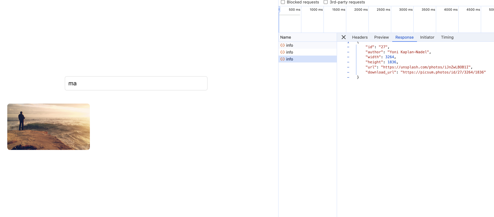

# Image Search Application

This is a React-based image search application that allows users to browse an infinite list of images from the [Picsum API](https://picsum.photos/), search for specific images, and display them in a popover (like Google image search). The search functionality uses debouncing to improve performance, and users can click on an image to display more details on the right side of the screen.

## Features:

-   **Infinite Scrolling**: The app fetches more images as you scroll down, creating an infinite list of images.
-   **Search with Debounce**: Users can search for images using a search bar, and the application debounces input to reduce the number of API calls.
-   **Random Image on Search**: The app fetches a random image ID between 10 and 30 for every search query.
-   **Image Popover**: Clicking on an image opens a popover on the right side that displays the image and its details.

## Screenshots:

### Home Screen with Image Popover:


### Infinite Scrolling:


### Search Image :



## Getting Started

### Prerequisites

To run this application, you’ll need the following installed on your system:

-   [Node.js](https://nodejs.org/) (v14 or higher)
-   [npm](https://www.npmjs.com/) (comes with Node.js)

### Installation

1. Clone the repository:

    ```bash
    git clone [google-search](https://github.com/Jatin-8898/google-search.git)
    ```

2. Navigate into the project directory:

    ```bash
    cd google-search
    ```

3. Install dependencies:
    ```bash
    npm install
    ```

### Running the Application

1. Start the development server:

    ```bash
    npm run dev
    ```

2. Open your browser and navigate to:
    ```
    http://localhost:5173
    ```

### How It Works:

-   **Infinite List of Images**: When the application loads, it fetches images from the [Picsum API](https://picsum.photos/v2/list). As you scroll down, the app automatically loads more images, creating an infinite scrolling experience.
-   **Debounced Search**: Typing in the search bar triggers a debounced search (500ms delay) that fetches a random image with an ID between 10 and 30 from the API.

-   **Image Popover**: Clicking on any image will display a popover on the right-hand side of the screen, showing the full-size image along with the author's details.

## Code Structure

The main components of the application are:

-   **`App.tsx`**: The main entry point of the app, responsible for fetching images, handling search, and rendering the grid and popover.
-   **`ImageGrid.tsx`**: Displays the grid of images.
-   **`ImagePopover.tsx`**: Handles the display of a single image on the right side of the screen when clicked.
-   **`useDebounce.tsx`**: Custom hook for debouncing search input to avoid excessive API calls.

## Key Components

### 1. **ImageGrid**:

Renders the images in a grid. It also observes the last image in the grid to load more images when the user reaches the bottom.

```tsx
<ImageGrid
	images={images}
	onImageClick={handleImageClick}
	lastImageElementRef={lastImageElementRef}
/>
```

### 2. **ImagePopover**:

Displays the clicked image and its details in a popover on the right side of the screen.

```tsx
<ImagePopover image={selectedImage} onClose={closePopover} />
```

### 3. **Debounced Search**:

Uses the `useDebounce` custom hook to delay the API call until the user has stopped typing for 500ms.

```tsx
const debouncedSearchTerm = useDebounce(searchTerm, 500);
```

## Custom Hook

### `useDebounce`

A simple custom hook that delays the execution of a function until after a specified delay (500ms in this case). It helps reduce the number of API requests made during user input.

## API Used

The application uses the [Picsum API](https://picsum.photos/) to fetch random images. When searching, the app generates a random image ID between 10 and 30 and fetches an image using the URL:

```
https://picsum.photos/id/{randomId}/info
```

## Conclusion

This image search application demonstrates how to implement infinite scrolling, debounced search, and an image popover feature in a React application. It's responsive, efficient, and provides a clean user experience similar to Google Image Search.

Feel free to fork, customize, and extend the application as per your needs! 😊
